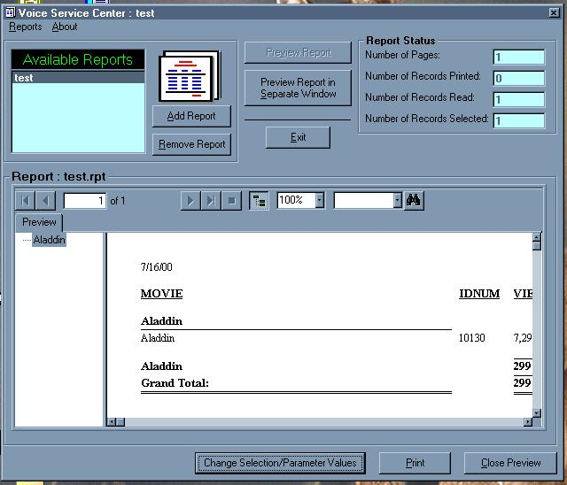



## Crystal Report Viewer

### Description

VERY VERY SIMPLE CRYSTAl REPORTS VIEWER - View Any Crystal Report with ease..lets you add reports to a list that you use all the time. Also allows for changing the parameter values. Very easy to understand code -- example report included. Hope you enjoy.
 
### More Info
 
your mind

Some Crystal Report exp.

a smile

hopefully, better vb knowledge

             |
---                |---
**Submitted On**   |2000-07-16 21:10:04
**By**             |[Stephen King](https://github.com/Planet-Source-Code/PSCIndex/blob/master/ByAuthor/stephen-king.md)
**Level**          |Intermediate
**User Rating**    |4.8 (43 globes from 9 users)
**Compatibility**  |VB 3\.0, VB 4\.0 \(16\-bit\), VB 4\.0 \(32\-bit\), VB 5\.0, VB 6\.0, VB Script, ASP \(Active Server Pages\) 
**Category**       |[Databases/ Data Access/ DAO/ ADO](https://github.com/Planet-Source-Code/PSCIndex/blob/master/ByCategory/databases-data-access-dao-ado__1-6.md)
**World**          |[Visual Basic](https://github.com/Planet-Source-Code/PSCIndex/blob/master/ByWorld/visual-basic.md)
**Archive File**   |[CODE\_UPLOAD78497162000\.zip](https://github.com/Planet-Source-Code/stephen-king-crystal-report-viewer__1-9817/archive/master.zip)

### API Declarations

Included in the .bas files

